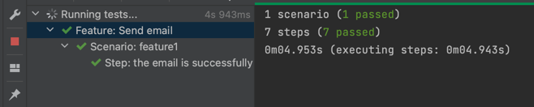
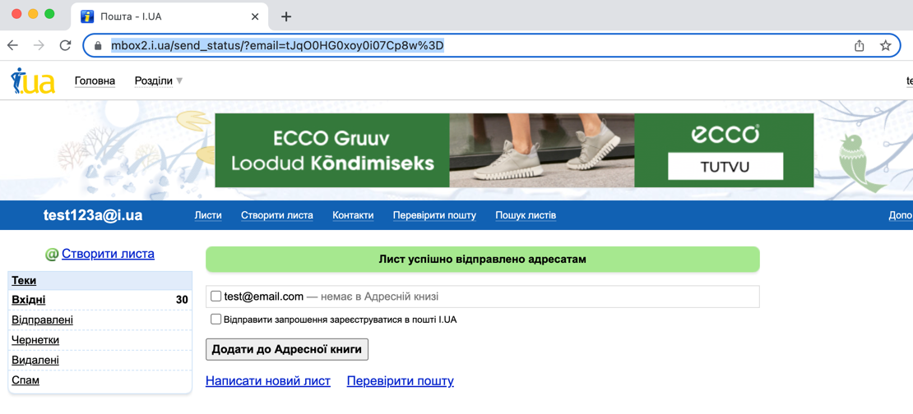

# i.ua  automation test

## System requirements
- Node.js 14 or above (https://nodejs.org/en/download/)
- One of the following browsers installed
    - Chrome 64 and above
    - Edge 79 and above
    - Firefox 86 and above

## Installation
- `git clone https://github.com/sama-mammadova/ledgerset-e2e.git`
- `cd ledgerset-e2e`
- `npm install`

## Configure
- edit `.env` file to set password for email user

## Run test
- `npx cucumber-js features`

